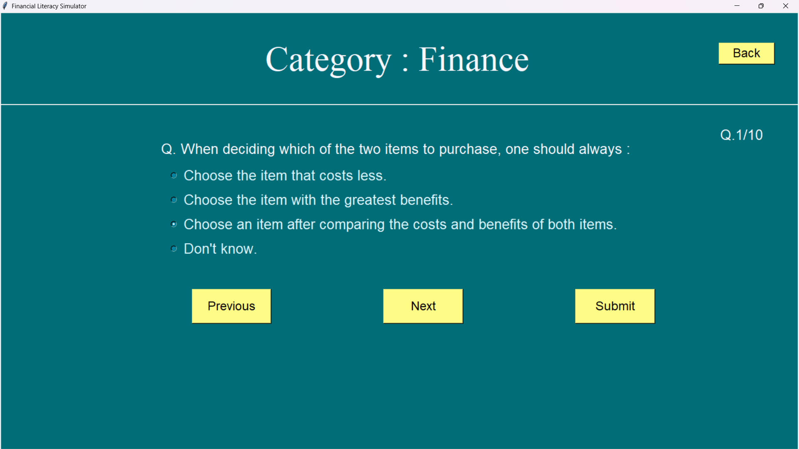
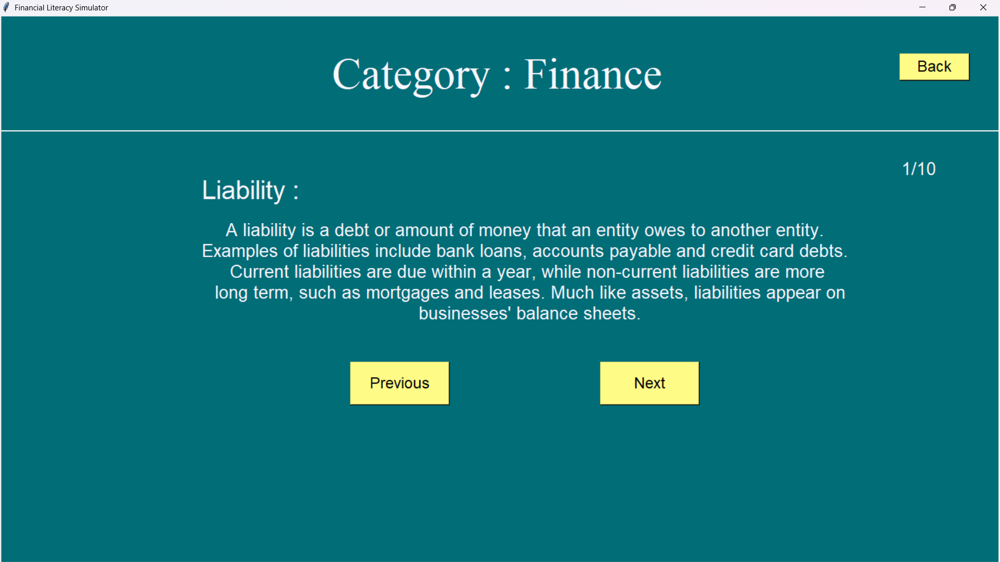

# 📊 Financial Literacy Simulator

An interactive and engaging **Financial Literacy Simulator** designed to help users grasp essential financial concepts through real-world simulations. Built with **Python's Tkinter** for a user-friendly front-end and **MySQL** for efficient data management, this project enhances financial decision-making skills in a dynamic way.

---

## 🌟 Features & Functionalities  

### 🏆 Financial Quiz  
✔️ Engaging quizzes covering diverse financial topics.  
✔️ Helps users reinforce their knowledge of **budgeting, investing, credit management, and more**.

### 🏦 Banking Simulation  
✔️ Offers a **risk-free virtual banking experience**.  
✔️ Users can **perform transactions, manage accounts, and explore banking services**.

### 📊 Financial Calculators  
✔️ A suite of **powerful financial calculators** for various scenarios:  
   - **EMI Calculator**: Estimate monthly loan repayments.  
   - **SIP Calculator**: Plan systematic investment growth.  
   - **Fixed Deposit (FD) Calculator**: Compute interest earnings on fixed deposits.  
   - **Recurring Deposit (RD) Calculator**: Track savings growth over time.  
✔️ Facilitates **quick and accurate financial planning**.

### 📖 Financial Terminologies  
✔️ A **comprehensive glossary** explaining key financial terms.  
✔️ Ensures users **develop a strong financial vocabulary**.  
✔️ Helps in making **informed financial decisions**.  

### 🎯 Goal-Based Financial Planning  
✔️ Allows users to **set and track personal financial goals**. 
✔️ Adjusts strategies dynamically to help users **achieve financial milestones** like:  
   - **Saving for a home or car**  
   - **Planning for education**  
   - **Retirement savings**  

---

## 🚀 Why This Project Matters  

📌 Many children lack **early financial education**, leading to difficulties in managing money as they grow.  

📌 This project bridges that gap by providing an **interactive learning platform** that makes finance **exciting and relatable**.  

📌 By integrating **real-world financial principles into a game**, children can develop a **lifelong understanding of money management**.  

---

## 🛠️ Tech Stack

🔹 **Front-end:** Tkinter (Python GUI)  
🔹 **Back-end:** SQLite3 (Efficient data storage and retrieval)  
🔹 **Additional Libraries:** Matplotlib (For visual representation), Pandas (Data handling)

---

## 📸 Screenshots

### 🏠 Landing Page

### 📝 Quiz Section

### 🏆 Quiz Result

### 🏦 Banking Simulation

### 📊 Financial Calculators

### 🎯 Goal Setting

### 📜 Terminologies

---

## 🎯 How It Works

1️⃣ Users interact with financial scenarios through a Tkinter-based interface.  
2️⃣ MySQL stores user data, tracking progress and enabling personalized learning.

## 📞 Contact & Support

💬 Found a bug? Have suggestions? Reach out!  
📧 Email: vikaspuri1830@example.com  
🌍 GitHub: [Vikaspuri1830](https://github.com/Vikaspuri1830)

---

## ⭐ Show Your Support
If you find this project helpful, consider giving it a ⭐ on GitHub!

---

🎓 **Empower yourself with financial literacy – because smart money decisions shape your future!** 💰
